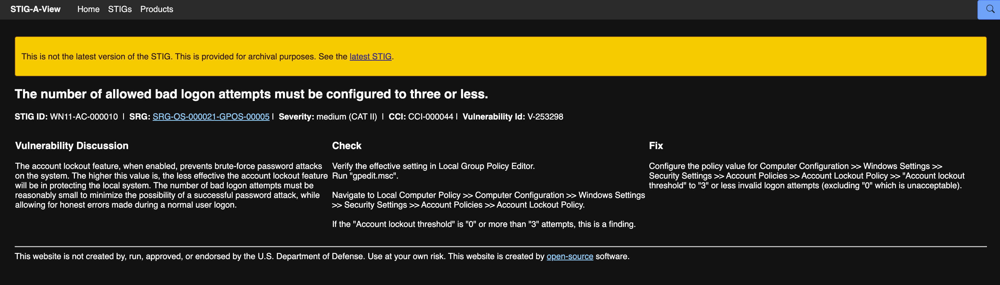
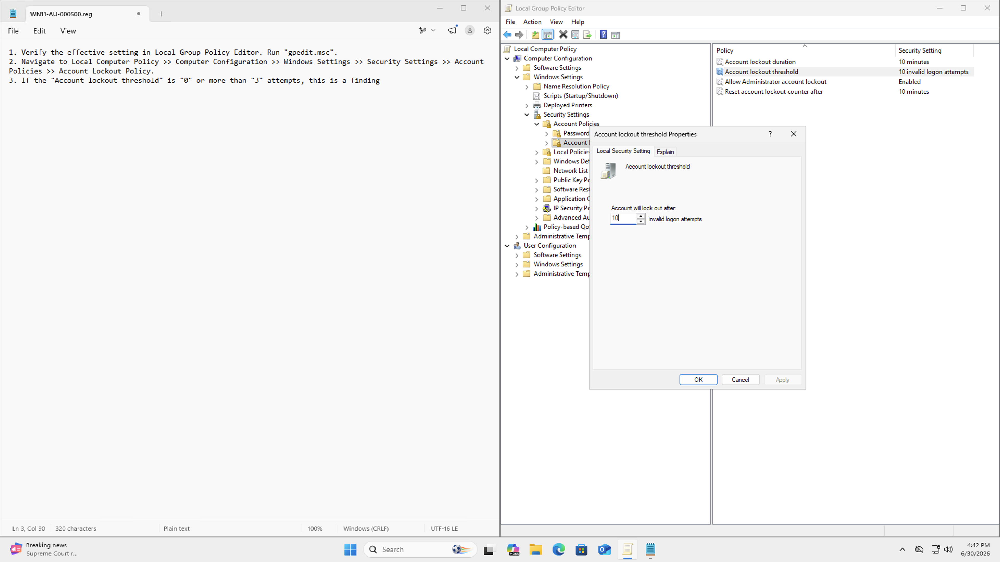
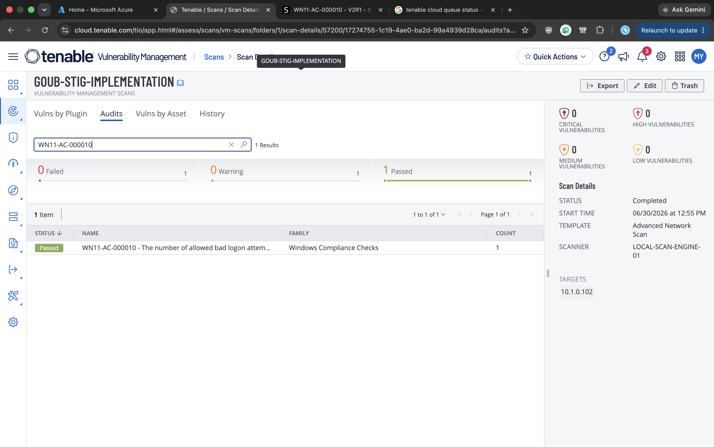
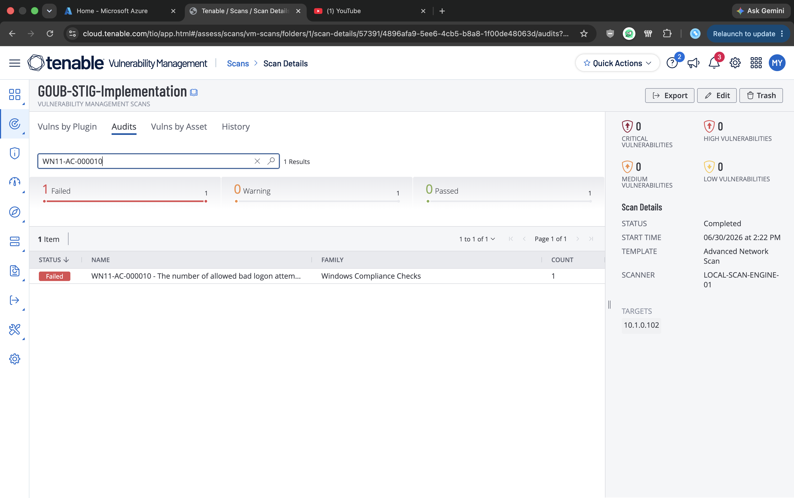
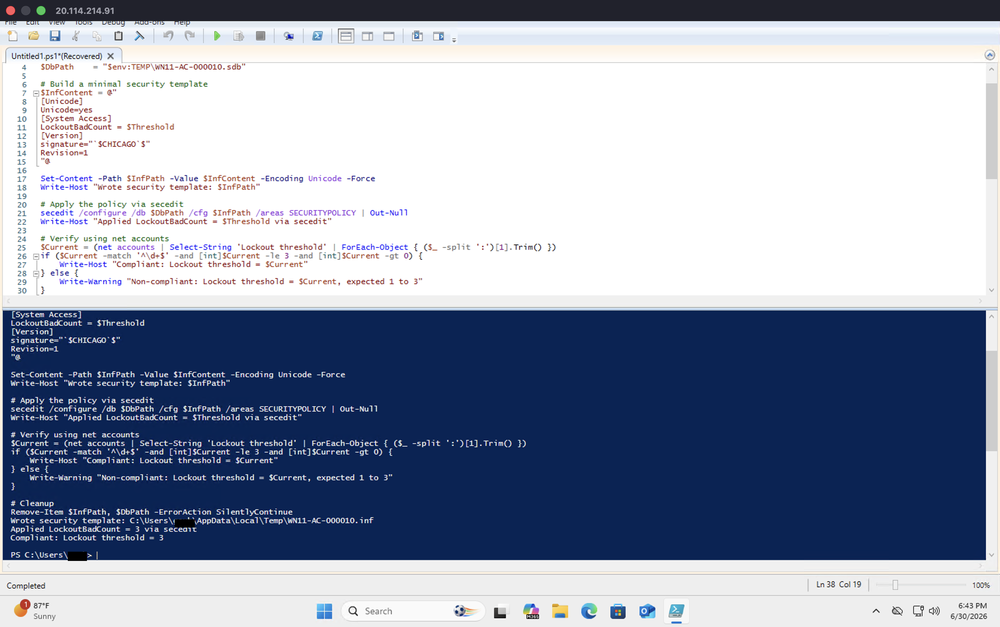
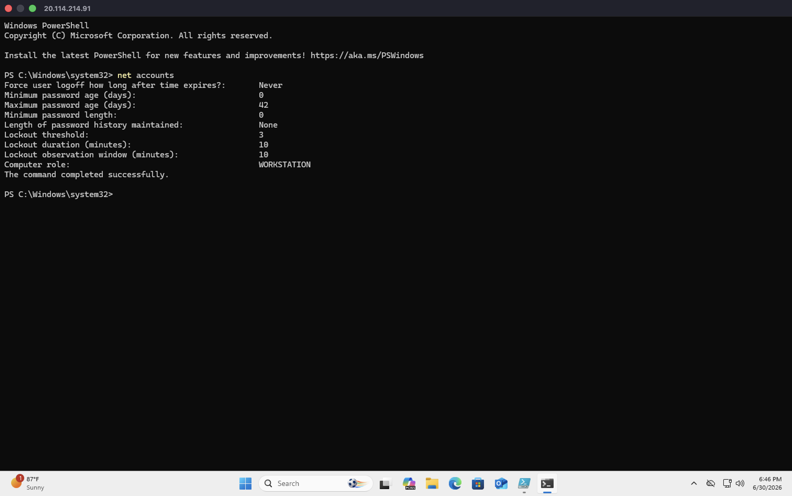
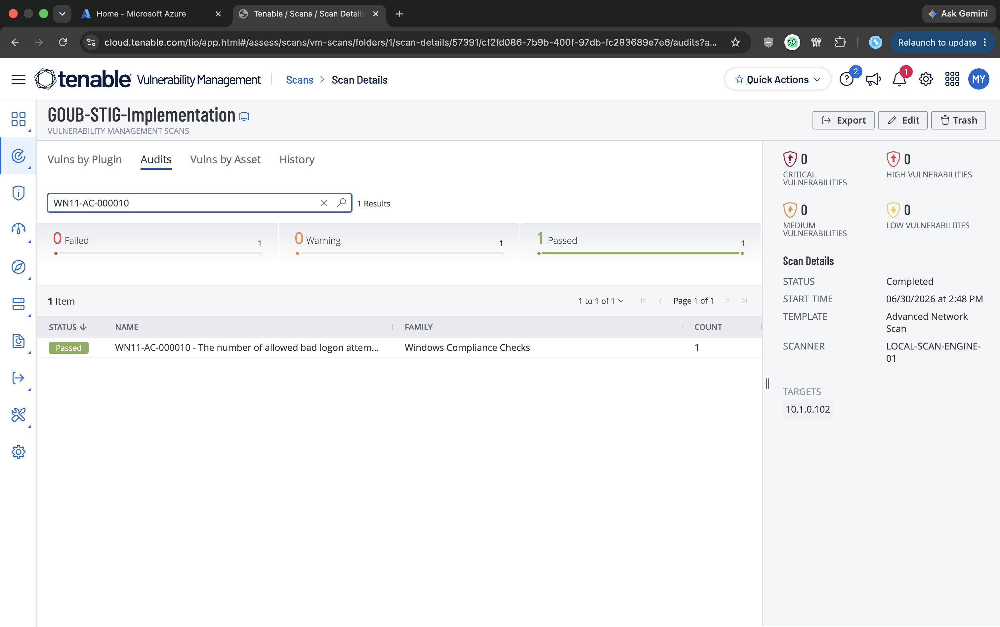

# Windows 11 STIG 03: V-253298 (WN11-AC-000010)

**Status:** Published
**STIG:** DISA Microsoft Windows 11 Security Technical Implementation Guide v2r7
**Finding:** V-253298 (WN11-AC-000010)

Part of the [DISA STIG Implementation with PowerShell](https://github.com/goubx/DISA-STIG-Implementation-w-PowerShell-series-) series.

---

## Overview

This entry hardens a stock Azure Windows 11 VM against one finding from the DISA Microsoft Windows 11 STIG v2r7 using PowerShell. The workflow:

1. Scan an unhardened Azure VM with Tenable's DISA STIG compliance audit.
2. Pick a failed finding from the Audit tab.
3. Remediate it manually to confirm the fix path.
4. Translate that fix into an idempotent PowerShell function.
5. Rescan to confirm the finding moves to passed.

This finding is the first non-registry one in the series. The Account Lockout Policy is stored in the local security database, not the registry, so the programmatic fix uses `secedit` with a security template instead of `Set-ItemProperty`.

---

## Target Platform

| Field            | Value                          |
|------------------|--------------------------------|
| OS               | Windows 11 Pro                 |
| Azure VM         | Standard                       |
| Private IP       | 10.1.0.102                     |
| Domain joined    | No                             |

---

## Tools Used

| Tool                          | Purpose                                       |
|-------------------------------|-----------------------------------------------|
| Tenable Nessus                | Scanning with the DISA STIG audit             |
| Windows PowerShell ISE        | Remediation engine                            |
| Local Group Policy Editor     | Manual remediation pass                       |
| secedit                       | Programmatic policy application               |
| net accounts                  | Verification of effective policy              |
| STIG-A-View                   | Finding reference and check details           |
| Azure                         | Lab VM hosting                                |

---

## Lab Setup

The lab uses a stock Azure Windows 11 VM with Windows Defender Firewall disabled so the Tenable scanner can reach the host across the lab network:


> Note: this is a lab-only step. In production you would scope firewall rules to permit the scan engine rather than disabling the firewall outright.

---

## Scan Configuration

The Tenable scan that produced this finding uses the Advanced Network Scan template, configured once and reused across all findings in this series:

1. **Scans → Create Scan → Advanced Network Scan**
2. Name: `GOUB-STIG-IMPLEMENTATION`
3. Target: the VM's private IP (`10.1.0.102`)
4. Scanner: internal scan engine
5. Credentials: local administrator on the VM

### Compliance audit

Under the Compliance tab, the DISA Microsoft Windows 11 STIG v2r7 audit is added:


### Plugin scoping

To keep the scan fast and focused on STIG findings only, every plugin family is disabled except one:

1. Plugins, filter for `policy`, enable **Policy Compliance**.
2. Inside Policy Compliance, enable only **Windows Compliance Checks** (Plugin ID 21156).


---

## Initial Scan

The scan against the Azure VM returned 149 failed audits out of 263 total checks. STIG findings on a default Windows 11 image are dense, which makes this a good source of remediation work:


The finding this repo documents:

> **WN11-AC-000010** : The number of allowed bad logon attempts must be configured to three or less.

Without account lockout, external bad actors get unlimited password guesses against the local account, which is the main reason this finding is medium severity rather than low.

---

## Finding Details

Pulled from STIG-A-View:

| Field            | Value                          |
|------------------|--------------------------------|
| STIG ID          | WN11-AC-000010                 |
| Vulnerability ID | V-253298                       |
| Severity         | Medium (CAT II)                |
| CCI              | CCI-000044                     |
| SRG              | SRG-OS-000021-GPOS-00005       |



**Why it matters:** The account lockout feature prevents brute-force password attacks. Setting the threshold too high (or to zero, which disables it) means an attacker with network access to the host can keep guessing passwords until they hit. A threshold of 1 to 3 is the STIG-acceptable range.

**Fix per DISA:**
> Configure the policy value for Computer Configuration > Windows Settings > Security Settings > Account Policies > Account Lockout Policy > "Account lockout threshold" to "3" or less invalid logon attempts (excluding "0" which is unacceptable).

Translated to the system change:

| Field         | Value                                                                  |
|---------------|------------------------------------------------------------------------|
| Policy        | Account Lockout Policy                                                 |
| Setting       | Account lockout threshold                                              |
| Storage       | Local security database (not the registry)                             |
| Required      | 1 to 3 invalid logon attempts                                          |
| Programmatic  | `secedit /configure` with security template (`.inf`)                   |

---

## Step 1: Manual Remediation

The default Windows 11 setting for "Account lockout threshold" is **10 invalid logon attempts**, which fails the STIG check.

Opening Local Group Policy Editor (`gpedit.msc`) and navigating to:

> Local Computer Policy > Computer Configuration > Windows Settings > Security Settings > Account Policies > Account Lockout Policy

Shows the threshold sitting at 10:



I changed the value to **3** in the Properties dialog and clicked OK. After restarting the VM and rerunning the Tenable scan, the finding passes:



The manual fix works. Now to translate it into a script.

---

## Step 2: Equivalent Security Template Format

The Account Lockout Policy lives in the local security database (managed via SAM/LSA), not in the registry. Group Policy writes to it through the UI; PowerShell can write to it through `secedit` using a security template (`.inf`).

The minimal template the script needs to produce:

```ini
[Unicode]
Unicode=yes
[System Access]
LockoutBadCount = 3
[Version]
signature="$CHICAGO$"
Revision=1
```

`LockoutBadCount = 3` under `[System Access]` is the programmatic equivalent of "Account lockout threshold: 3" in gpedit. Applying it via `secedit /configure /areas SECURITYPOLICY` writes the same effective policy GPO did.

---

## Step 3: Revert and Re-verify

I reverted the threshold back to 10 in Local Group Policy Editor and reran the scan. The finding fails again, as expected:



Now there's a clean baseline to validate the script against.

---

## Step 4: PowerShell Remediation

```powershell
function Set-StigRule-V253298 {
    <#
    .SYNOPSIS
        V-253298: The number of allowed bad logon attempts must be configured to three or less.

    .DESCRIPTION
        Severity:        CAT II (Medium)
        STIG ID:         WN11-AC-000010
        CCI:             CCI-000044
        Tenable Plugin:  Windows Compliance Checks (21156)
        Reference:       DISA Microsoft Windows 11 STIG v2r7

        The Account Lockout Policy is stored in the local security database,
        not the registry. This function writes a minimal security template and
        applies it via secedit, setting LockoutBadCount to 3. Verification
        parses 'net accounts' output to confirm the effective threshold.

    .EXAMPLE
        Set-StigRule-V253298
    #>
    [CmdletBinding(SupportsShouldProcess)]
    param()

    $Threshold = 3
    $InfPath   = "$env:TEMP\WN11-AC-000010.inf"
    $DbPath    = "$env:TEMP\WN11-AC-000010.sdb"

    # Build a minimal security template
    $InfContent = @"
[Unicode]
Unicode=yes
[System Access]
LockoutBadCount = $Threshold
[Version]
signature="`$CHICAGO`$"
Revision=1
"@

    Set-Content -Path $InfPath -Value $InfContent -Encoding Unicode -Force
    Write-Host "Wrote security template: $InfPath"

    # Apply the policy via secedit
    secedit /configure /db $DbPath /cfg $InfPath /areas SECURITYPOLICY | Out-Null
    Write-Host "Applied LockoutBadCount = $Threshold via secedit"

    # Verify using net accounts
    $Current = (net accounts | Select-String 'Lockout threshold' | ForEach-Object { ($_ -split ':')[1].Trim() })
    if ($Current -match '^\d+$' -and [int]$Current -le 3 -and [int]$Current -gt 0) {
        Write-Host "Compliant: Lockout threshold = $Current"
    } else {
        Write-Warning "Non-compliant: Lockout threshold = $Current, expected 1 to 3"
    }

    # Cleanup
    Remove-Item $InfPath, $DbPath -ErrorAction SilentlyContinue
}
```

What it does, in order:

1. **Build the template.** A heredoc string composes the `.inf` content with `LockoutBadCount = 3` under `[System Access]`. Unicode encoding is required by `secedit`.
2. **Write to disk.** `Set-Content` saves the template to the user temp directory.
3. **Apply via secedit.** `secedit /configure /areas SECURITYPOLICY` reads the template and writes the setting into the local security database.
4. **Verify with net accounts.** Parses the `Lockout threshold` line and confirms the value is between 1 and 3. Emits a clear Compliant or Non-compliant line.
5. **Clean up.** Removes the temp template and database files.

Running it from an elevated PowerShell ISE session against the reverted baseline:



Output:

```
Wrote security template: C:\Users\[REDACTED]\AppData\Local\Temp\WN11-AC-000010.inf
Applied LockoutBadCount = 3 via secedit
Compliant: Lockout threshold = 3
```

A separate `net accounts` from a clean PowerShell window confirms the effective threshold:



---

## Step 5: Final Validation

After restarting the VM and rerunning the same Tenable scan, the finding passes:



---

## Result

| Stage                        | WN11-AC-000010 |
|------------------------------|----------------|
| Initial scan                 | Failed         |
| After manual remediation     | Passed         |
| After reverting              | Failed         |
| After PowerShell remediation | Passed         |

The finding was cleared both by hand and programmatically, with the scan-pass state proven against a clean baseline both times.

---

## Notes

### Operational impact
Users on the target VM will be locked out for 10 minutes after 3 invalid logon attempts. That's the expected tradeoff: it stops brute-force attacks but also locks out legitimate users who mistype their password three times in a row. The 10-minute lockout duration and observation window are separate settings; this finding only addresses the threshold itself.

### Lesson learned: not every STIG finding is a registry value
Most Windows STIG findings are registry-based and remediated with `Set-ItemProperty` or `New-ItemProperty`. Account Policies (lockout, password complexity, length, etc.) are different. They live in the local security database, accessed through `secedit`, `secpol.msc`, or the underlying `LsaPolicy` APIs. When a STIG fix references a path under "Account Policies" or "Local Policies > Security Options," registry edits won't move the needle. Use a security template (`.inf`) with `secedit /configure` instead.

---

## References

- [DISA STIG Library](https://public.cyber.mil/stigs/)
- [STIG-A-View entry for V-253298](https://www.stigaview.com/products/windows-11/v2r7/V-253298/)
- [Tenable Plugin Database](https://www.tenable.com/plugins/search)
